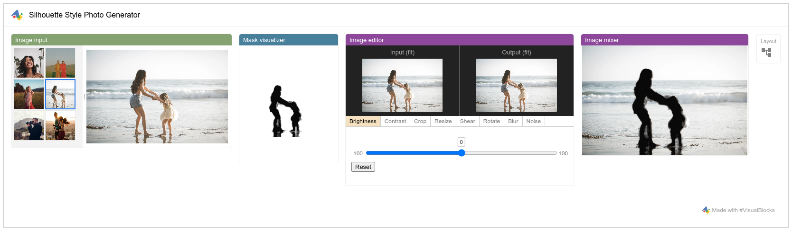

# Visual Blocks runner library

This library allows you to create a Visual Blocks runner panel inside your
application and load a specific pipeline.



## Setup

### npm

Add the following dependency to the `package.json` file:

```
"@visualblocks/runner": "0.0.1"
```

### Script tag

Add the following script tag to the `index.html` file:

```html
<script src="https://cdn.jsdelivr.net/npm/@visualblocks/runner/visualblocks.js"></script>
```

## How to use

*   Create a Visual Blocks instance.

    ```typescript
    // Not needed when using script tag.
    import '@visualblocks/runner'

    // Create an instance inside the given container with a project json url
    // (optional).
    const vbInstance = await visualblocks.create('.vb-container', {
      // This is optional. If unset, the runner will just show blank content.
      projectJsonUrl: PROJECT_JSON_URL,

      // You can also load a json string/object as the initial content.
      //
      // projectJson: PROJECT_JSON
    });
    ```

*   Load project on demand after the VB instance is initialized.

    ```typescript
    vbInstance.loadProjectFromJsonUrl(PROJECT_URL);

    // You can also load project from a json string/object.
    //
    // vbInstance.loadProjectFromJson(PROJECT_JSON_OBJ);
    ```

*   Reset runner.

    ```typescript
    // This will reset the runner panel and show a blank UI.
    vbInstance.reset();
    ```

*   Get the current project json.

    ```typescript
    // Subscribe to the BehaviorObject `curProject$` to get the current project
    // json.
    vbInstance.curProject$.subscribe(curProject => {
      console.log('Current project', curProject);
    });
    ```

## Demo

Check out the
[live demo](https://storage.googleapis.com/tfweb/vblib-demos/demo1-basic/index.html),
and see its source code [here](../demo_runner_basic/).
